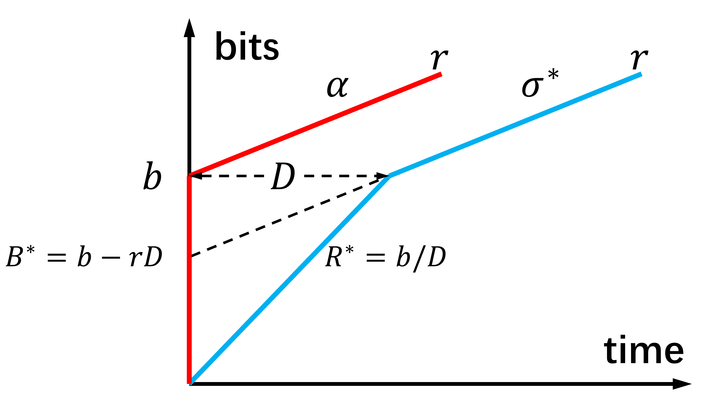

# Discrete Event Simulator for Traffic Shaping Network

## Overview

This repository provides implementation of a discrete event simulator for traffic shaping networks in Python. The simulator covers several schedulers, shapers, and shaping mechanisms.

### Scheduler

We currently support First-In-First-Out (FIFO) and Service Curve-based Earliest Deadline first (SCED) scheduling policies. In the future, we will also add static priority schedulers.

### Traffic Shaper

We provide traffic shapers in the form of packetized token buckets. Particularly, a `MultiSlopeShaper` module takes as input multiple token buckets to generate a piece-wise linear and concave shaping curve. In this module, a packet is released as soon as it conforms with every token bucket.

Based on `MultiSlopeShaper`, we implement the Two-Slope Reprofiling Curve (2SRC) introduced in [**On the Benefits of Traffic “Reprofiling” the Multiple Hops Case—Part I**](https://ieeexplore.ieee.org/abstract/document/10509732/). Specifically, as illustrated in the figure below, we assume each flow has a traffic profile α in the form of a token bucket, i.e., traffic from the flow conforms with α upon arriving at the network. We insert a 2SRC σ at different places inside the network (see the next section for details) to regulate the flow traffic, whose parameters can be computed based on α and a so-called "reprofiling delay" D.

<p align="center">
    
</p>

### Shaping Mechanism

We provide shaping mechanisms with different levels of complexity. They include: Per flow shaping, where each user flow is regulated at every hop it traverses. Interleaved shaping, where one shaper is placed at every output queuing point of the switch for every input port to regulate the aggregate traffic of passing user flows. Ingress shaping, where user flows are only regulated at network ingress. No shaping, where flows are not regulated at all inside the network.

## Requirements

We recommend a recent Python 3.7+ distribution of [Anaconda](https://www.anaconda.com/products/individual).

To keep a local copy of our code, clone this repository and navigate into the cloned directory. You should then be ready to run the scripts once you installed all the pre-requisite packages.

```
# First navigate to the directory where you want to keep a copy of the code.
git clone https://github.com/qiujiaming315/traffic-shaping-network-simulator.git
# Navigate into the cloned directory to get started.
cd traffic-shaping-network-simulator
# Install all the required modules.
pip install -r requirements.txt
```

## Usage

### Generating Flow Route and Flow Profile

The simulator takes as input flow routes and profiles. Before running the simulation, you need to first generate the input data.

We provide scripts that facilitate generating flow route and flow profile. They are available in `create_route.py` and `create_flow.py` located in the `input/` sub-directory. Each script allows you to either specify your own input data or generate data using the build-in functions. You can try these different options by modifying the `__main__` function (with some example codes included) of each script.

Once you modified the `__main__` function according to the desired configurations, you can directly run those scripts through command lines.

```
# Navigate into the input/ sub-directory.
cd input
# Generate flow route and flow profile.
python create_route.py
python create_flow.py
```

#### Flow Route

The flow route file specifies the route taken by each user flow as it traverses through the network. The flow route is represented as an `m × n` matrix, with `m` and `n` being the number of user flows and network links, respectively. The matrix consists of integers specifying whether a flow traverses a link, and if so, in which order. For example, if flow 3 traverses link 2, followed by link 5 and then link 3, the third row of the flow route matrix should be ``[0, 1, 3, 0, 2]``, assuming the network has 5 links in total.

#### Flow Profile

We use flow profile to specify the token bucket parameters (rate, burst size) as well as the end-to-end latency target of each flow in the network. The flow profile is represented as an `m × 3` matrix, where `m` is the number of flows. The three columns stand for rate, burst size, and latency target, respectively.

### Running the Simulation

The main script for running the simulation is `simulate.py`. Running it with `-h` gives you a detailed description over a list of parameters you can control:

- `flow_path`: path to the input flow profile data.
- `route_path`: path to the input flow route data.
- `out_dir`: directory to save the output file.
- `file_name`: name of the output file.
- `--simulation-time`: total simulation time (in seconds).
- `--scheduling-policy`: scheduling policy for the network.
- `--shaping-mode`: shaping mechanism to regulate user flows.
- `--buffer-bound`: size of the scheduler buffers.
- `--arrival-pattern-type` `awake-dur` `awake-dist` `sync-jitter`: parameters to control the traffic arrival pattern.

For example, to run a 100s simulation given the flow profile `input/flow/flow1.npy` and flow route `input/route/route1.npy`, using FIFO schedulers, per flow shaping, infinite buffer, and the default traffic arrival pattern, you can use the following command to save the results to the folder `output/` under the name `result.pickle`.

```
# Make sure you are in the root directory of this repo,
# where simulate.py is located.
python simulate.py input/flow/flow1.npy input/route/route1.npy output result --simulation-time 100 --scheduling-policy fifo --shaping-mode per_flow --buffer-bound infinite
```

### Data Collection

The simulator allows you to collect data including the arrival time and end-to-end delay of each packet, the desired delay bound of each user flow, and the maximum backlog observed at each queuing point (schedulers and shapers). From this data you should be able to easily compute statistics such as packet loss rate, delay violation rate, and packet delay distribution.


### Running Simulations for Reinforcement Learning

In addition to run regular network simulation, you can also wrap the simulator into a reinforcement learning environment and run it as a game. An example run is provided in `rl_play.py`. Running it with `-h` gives you a detailed description over a list of parameters you can control. They include the parameters for the network simulator, and the following additional inputs:

- `pause_interval`: the length of a time step (in second) for the reinforcement learning environment.
- `high_reward` `low_reward` `penalty`: parameters for reward computing of the reinforcement learning environment.

Details of the reinforcement learning environment, including how it uses the above parameters to compute reward at each time step, is available in `lib/README.md`.

Similar to the command for running a network simulation, you can specify the values of the additional parameters to run a reinforcement learning episode.

```
# Make sure you are in the root directory of this repo,
# where rl_play.py is located.
python rl_play.py input/flow/flow1.npy input/route/route1.npy --pause-interval 1 --high-reward 1 --low-reward 0.1 --penalty -10 --simulation-time 100 --scheduling-policy fifo --shaping-mode per_flow --buffer-bound infinite
```

### Library

We factor various parts of the code into different modules in the `lib/` sub-directory. Many of them are used as building blocks in `simulate.py`.

- `network_simulator.py`: main body of the network simulator.
- `schedulers.py`: a collection of different schedulers.
- `traffic_shapers.py`: a collection of traffic shapers.
- `rl_env.py`: a wrapper of the network simulator to create a reinforcement learning environment. See `lib/README.md` for details.

## License

This code is being released under the [MIT License](LICENSE).
